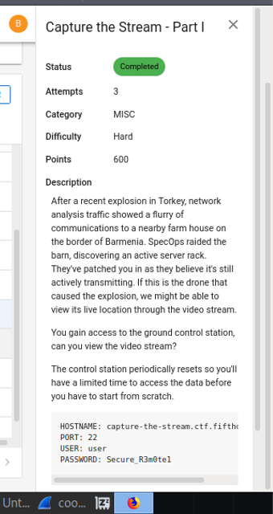
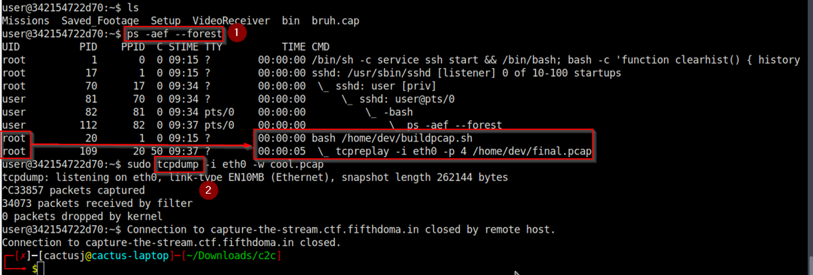
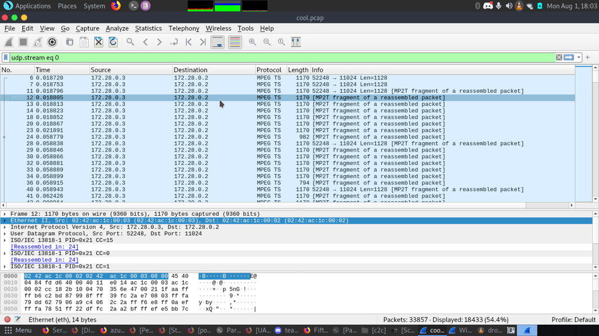
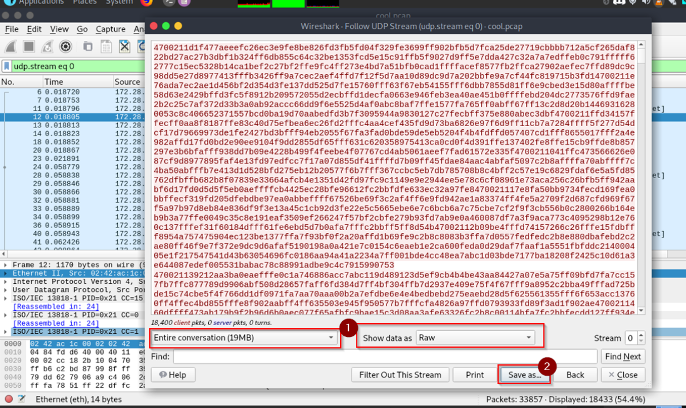
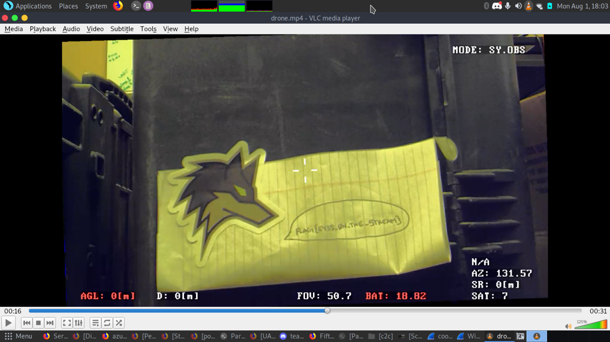

# Capture the stream (part 1) writeup

- After loggin in, I first looked through all the files available
- There weren't any obvious hints, so I assumed they were for part 2 of the challenge
- After some enumeration, I noticed that **tcprelay** was running as root
    - It was replaying traffic from a file called 'final.pcap'
    - I needed to capture that traffic, so I decided to use **tcpdump** since it was already installed (`which tcpdump`)
- Sudo could not be run by the current user, but I tried to use it with **tcpdump** anyway and it worked :))

- Hmmm.. MPEG traffic. Looks like I'll be able to reassemble the traffic

- I decided to export it the weird way by converting to raw bytes and saving as an MP4

- Sweet! We got a video of the drone recording the flag

